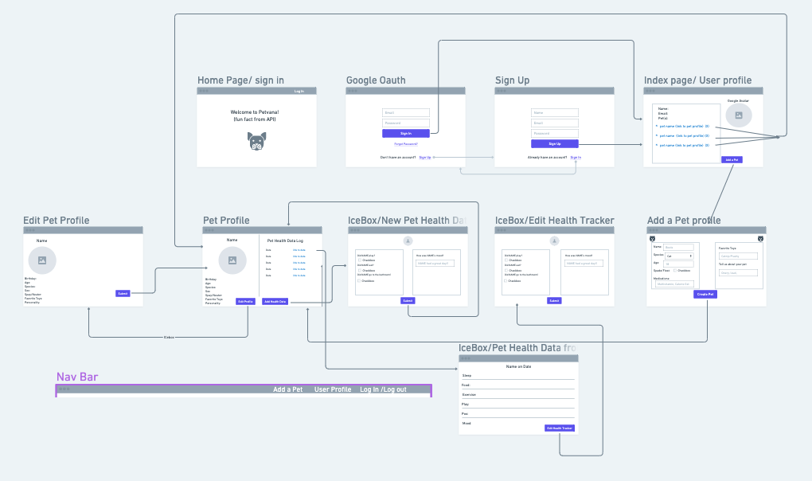
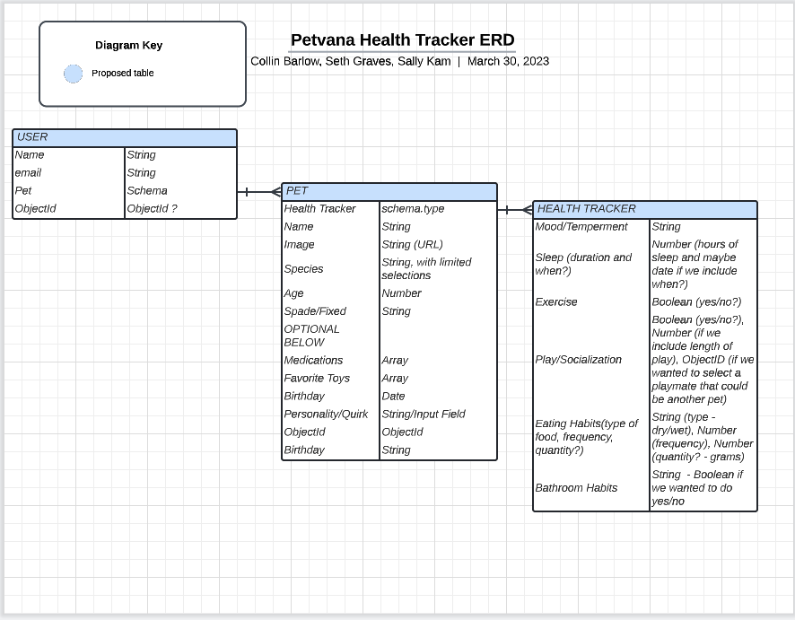
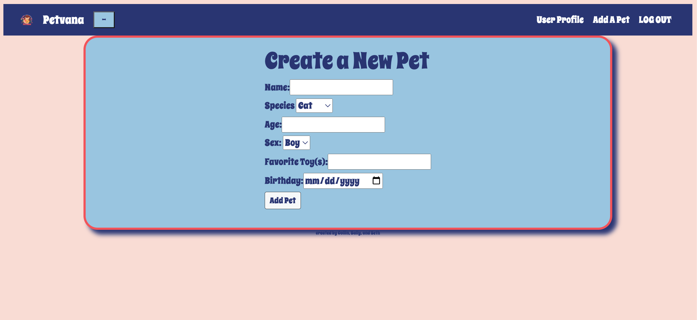
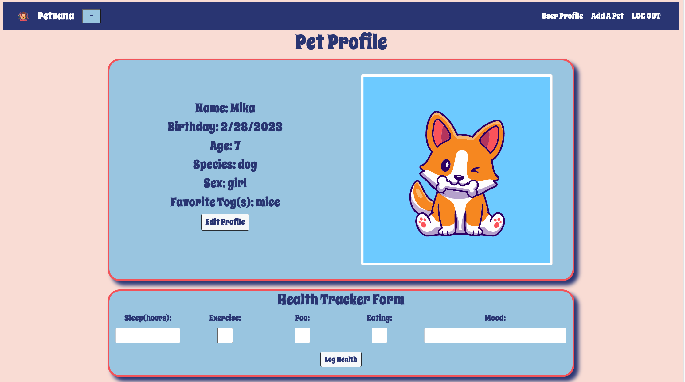
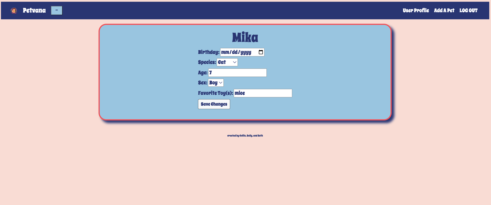
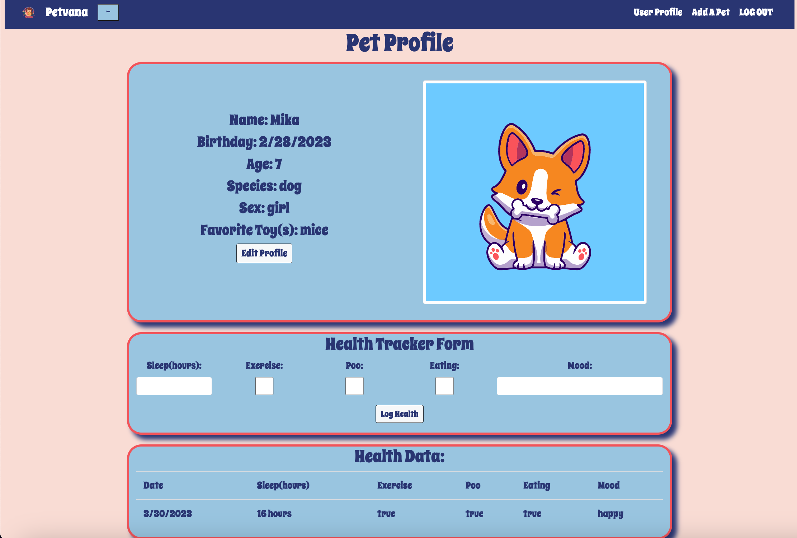

# <strong><em>Petvana </em></strong>


[](https://GitHub.com/Naereen/StrapDown.js/graphs/commit-activity)


***

## Petvana Overview
Welcome to Petvana, the pet health-tracking application designed to help your pet achieve nirvana! Through a simple connection of your Google account, the path to better pet health begins with adding your animals to your profile, which are then conveniently displayed. By clicking on each Pet Profile, all of your pet details and health data are available for perusal.

***

## Technologies Used: 


***

## Getting Started:

* Begin your pet health journey by checking out [Petvana](https://petvana.herokuapp.com/)!

* Learn about the planning behind the app by looking at this [Trello Board](https://trello.com/invite/b/xysXs5C1/ATTIf2b993d44cf886bdfa6df0f88817e92dEFB3DE0C/petvana-project)!

* Our wireframe included what we created for this iteration, and possible future developments.


* We took a 3 model approach to our data structure with each model referencing another. 



***

## Implemented User Stories:
* As a user, I would like to be able to sign into the application with my Google account because it is quick and efficient.

* As a user, I would like to be able add a new pet to my pet tracking application because I am an adoption fanatic.


* As a user, I would like to see all of my pets and a broad overview of their information.

* As a user, I would like to be able to remove pets from my profile because sometimes I foster pets short-term.

* As a user, I would like to click a button to see a detailed view of one specific pet because I want to track their information over time.


* As a user, I would like to be able to update static information about my pet as they change or get older.


* As a user, I would like to be able to add health data for my pet each day.



***

## Next Steps:
* Implement edit functionality of individual pet health data. 
* Implement delete functionality of individual pet health data.
* Incorporate a third-party API to provide cat/dog facts for the user.

***

## Overcoming Challenges:

* The following code block represents Petvana's greatest obstacle of the project:
```js
async function createPet(req, res) {
    try {
      // Get the currently authenticated user
      const user = await User.findById(req.user._id); 
      if (!user) {
        return res.status(404).json({ error: 'User not found' });
      }
      // setting what properties will be in req.body
      const { name, species, age, sex, birthday, favoriteToy } = req.body;

      // declares a new instance of Pet data
      const pet = new Pet({
        name,
        species,
        age,
        sex,
        user: user._id,
        birthday,
        favoriteToy
      });
      // saves the pet data based on the model
      await pet.save();
      // pushes the specific pet data into the user pet data
      user.pet.push(pet._id);
      await user.save();
      // after user.pet has been saved, redirect back to the user profile page
      res.redirect('/user');
    } catch (err) {
      console.error(err);
      res.sendStatus(500);
    }
};
```
* As seen above, the createPet function creates a new pet instance and saves it to the database.
* Technically, this was our biggest challenge for this project. It required us to integrate our learnings across different concepts into one functional piece of code. We leveraged  middleware, models, and our understanding of how data flows all into one function that is crucial to Petvana. 